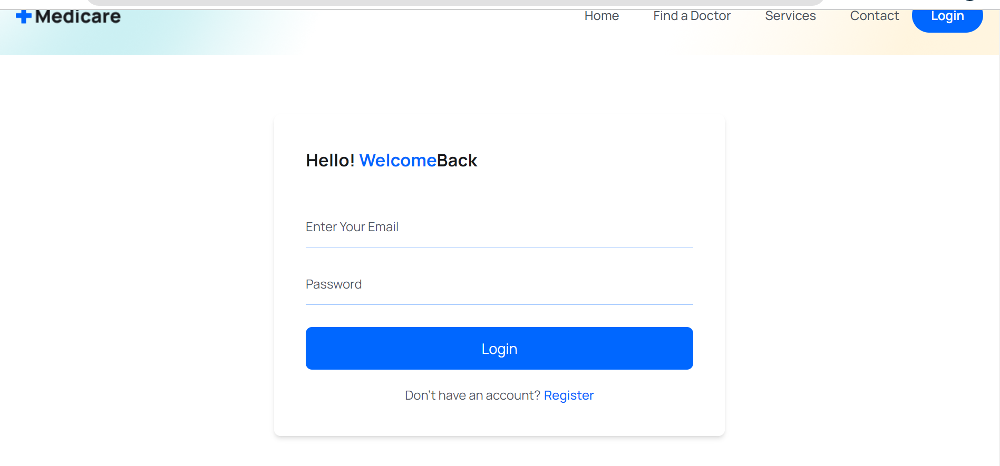

# Doctor Appointment Booking App  

**steps to install app & run on local:**
1. git clone https://github.com/kemkartanya/appointment-scheduling-app.git
2. cd appointment-scheduling-app
3. npm install 
4. cd frontend, then 'npm run dev' (for running frontend)
5. need to create account on MongoDB Atlas, and connect it to backend & also JWT authentication in .env file 
6. open new terminal, cd backend, then 'npm run start-dev'
7. hurray! the website is running on localhost.  

**techstack used**  
frontend: html, css, javascript, reactjs, tailwindcss, vitejs  
backend: expressjs, nodejs,  
database: MongoDB    

**functionalities of the app**
1. login/register in the system (doctor or patient)
2. patient can book appointment with doctor
3. can see the doctors available
4. see the services provided & testimonials by patients
5. can search a doctor
6. can contact us through form 
7. FAQs available  

**some snapshots of website**

 
working on this app & including more functionalities as calender view, linking apis with frontend ...